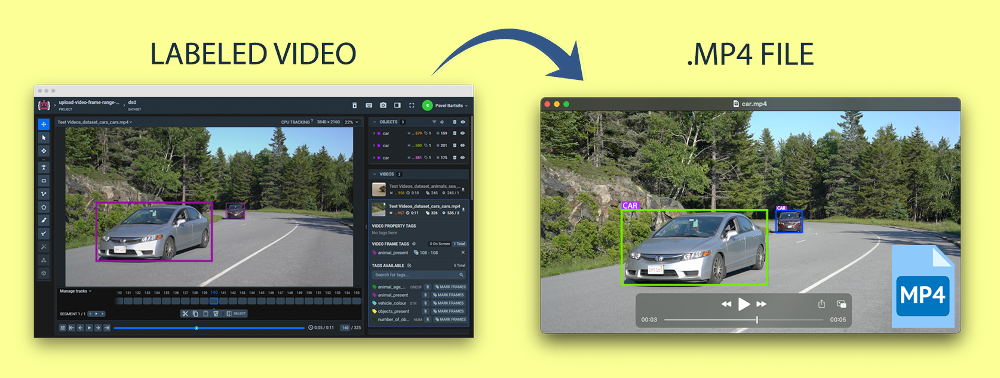
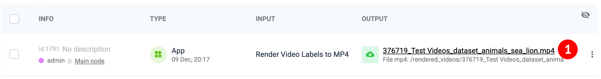

# Render Video Labels to MP4

  <a href="#Overview">Overview</a> •
  <a href="#How-To-Use">How To Use</a>

## Overview

Creates presentation mp4 file based on labeled video. Object instances are always rendered with random colors. It helps to distinguish objects of the same class on the frame. Class name is rendered with original class color. 

Example of the results:
Example: bitmap with opacity  |  Example: rectangles
:-------------------------:|:-----------------------------------:
  |  

## How To Use

**Step 1:** Add app to your team from Ecosystem if it is not there

**Step 2:** Copy to clipboard id of the video that should be rendered with labels

**Step 2:** Run app from team apps page: 

**Step 3:** Define input arguments in modal window: `video id`, `line width`, `opacity` for bitmap objects, `frame range`, etc.. and press `Run` button

**Step 4:** Wait until task is finished. Result video is saved to `Team Files` to directory: `/rendered_videos/` with name `<video-id>_<video-name>.mp4`. 

File can be download directly from team files (right click on the file -> `Download`) 

or from workspace tasks list by clicking on the download URL in task output column

